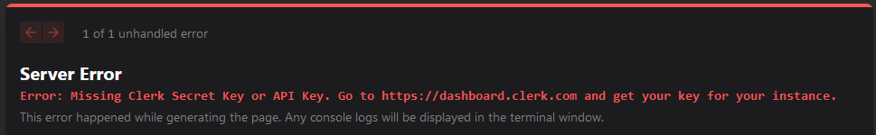

# TODOs

(1) Schema,

(2) Next.JS app with a hello world

(3) Instructions in the readme for clerk to set up a new user (might as well create a dummy user)

(4) 1-2 cypress tests

(5) 1-2 unit tests

(6) Postgres in docker working

# Update name field in package-lock

When using this repo as a template for another project, make sure to update the name field in the package-lock.json file.

# Running locally with prisma

1. Install docker desktop - [See Docker installation instructions](https://www.docker.com/products/docker-desktop/)

- For additional guidance installing Docker, see [below](#help-installing-docker)

2. Copy the DATABASE_URL environment variable from .env.development into .env (This should be read from .env.development, but it's not working right now)
3. Run `npm run pg:start` - this runs a docker command to start up a local postgres database
4. Run `npm run db:migrate:reset` - this runs a prisma command to clear your database, apply all migrations, and run the seed script
5. Run `npm run dev` to run the app

### Clerk environment variables

If you see an error like the one pictured below, you need to set 2 environmental variables 

Add this two variables in your `.env.local` file:

```
NEXT_PUBLIC_CLERK_PUBLISHABLE_KEY=<NEXT_SECRET_KEY>
CLERK_SECRET_KEY=<CLERK_SECRET_KEY>
```

For the actual values please reach out to _Adam_ @afanslau on Discord

To create a migration:

1. Edit the `schema.prisma` file with your changes
2. Run `npm run db:migrate-dev` to create a migration file and apply it.
3. If needed, run `npm run db:reset` to clear your DB and re-run the seed script

## Environment variables

Nextjs will load environment variables in the following priority order

1. .env.local - Nextjs reads this file in dev. Secrets should go here. Env vars specific to a developer's local machine should go here also. .env.local should be in .gitignore
2. .env.development - This file will be used only in development environments. It should have variables that are common across all developer's local machines. Commit it to the repo so we can share common, non-secret variables.
3. .env.production - This will only be read in prod. Not needed for now, since vercel is supplying the environment variables for deploys.
4. .env - This file will serve as the default variables for all environments. Note that prisma commands locally will read from here. So your DATABASE_URL env var should go in here

See nextjs docs https://nextjs.org/docs/pages/building-your-application/configuring/environment-variables

## Help installing Docker

### Windows 10/11 Pro

- See [Docker install page for Windows](https://docs.docker.com/desktop/install/windows-install/) and click the "Docker Desktop for Windows" button near the top to download the installer. Run the installer with the default settings and you're done.

### Windows 10/11 Home/Studio

- You will need to install and use WSL, the Window Subsystem for Linux. It allows you to install the full linux kernel in your Windows environment.
- To install WSL, open Powershell as an administrator and run `wsl --install`. By default, this will install the Ubuntu Linux distribution.
- Tip: Now, I recommend downloading the [Windows Terminal app](https://apps.microsoft.com/store/detail/windows-terminal/9N0DX20HK701?hl=en-us&gl=us). It allows you to easily select a terminal profile making it easy to open a terminal session with WSL
- In Windows Terminal, use the arrow to the right of the tabs to open a dropdown menu and select Ubuntu. This will open a WSL terminal session in a new tab. You are now in an Ubuntu Linux environment.
- Before installing Docker, we need to install a dependency first by running `sudo apt install gnome-terminal`
- Now, to install Docker, run `sudo -E apt-get -qq install docker.io -y`
- At this point, you need to reboot the WSL VM by running `wsl.exe --shutdown`. After it shuts down, it notifies you in the terminal. You can press enter again to start it back up.
- Docker should now be installed.

### MacOS

- See [Docker install page for MacOS](https://docs.docker.com/desktop/install/mac-install/)
- You can simply click one of the two buttons at the top to download the dmg file
- Note: Be sure to download the correct one for your Mac's architecture

### Linux

- See [Docker install page for Linux](https://docs.docker.com/desktop/install/linux-install/)
- Download the correct package for your distro

## Testing

### E2E tests with Cypress

#### Setup

Cypress env variables are set in `cypress.env.json`. Create a copy of `cypress.env.json.example` and name it `cypress.env.json`. Then, change the password to the one used by the clerk test user.

#### Run `cypress run` via npm script

1. Run `npm run dev` to start the local development server
1. Run `npm run test-e2e` to run the Cypress tests

#### Run with `cypress open`

TODO: Work in process, needs API keys, etc...

1. Run `npm run dev` to start the local development server
1. Run `npx cypress open`

## ORM

We use [Prisma](https://www.prisma.io/) as our ORM. See the [Prisma docs](https://www.prisma.io/docs/) for more info.
